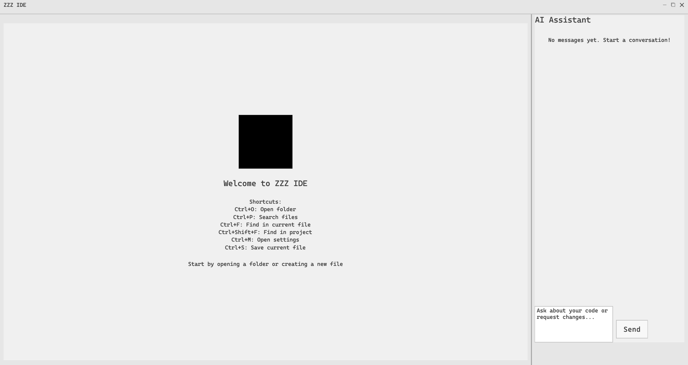

  

# zzz  
**A fast and simple open-source IDE for Kotlin Android app development.**  

---

## Features  

- ⚡ **Fast & Lightweight** – No clutter, just the essentials.  
- 📱 **App Mirroring** – Uses **scrcpy** for real-time mirroring & testing.  
- 🔍 **Search** – Quickly find files, functions, and references.  
- 🤖 **AI Chatbot** – Coding help inside the IDE (users cover API costs).  

---

## Installation  
1. **Download** the latest [release](https://github.com/manuelcabanzo/zzz/releases) (portable executable).  
2. **Run** the .exe—no installation needed.  
3. **Start coding!**  

---

## Work in Progress  
| **Untested**       | **Unfinished**        |  
|--------------------|----------------------|  
| Usage on macOS    | App creation menu     |  
|                    | LSP (Language Server) |  

💡 **Want to help?** Check out the unfinished section and contribute!  

---
## Gallery  

<table>
  <tr>
    <td align="center" width="50%">
       
      <b>Welcome Screen</b>
    </td>
    <td align="center" width="50%">
       
      <b>All Panels On</b>
    </td>
  </tr>
  <tr>
    <td align="center">
       
      <b>AI Copilot</b>
    </td>
    <td align="center">
       
      <b>AI API Config</b>
    </td>
  </tr>
  <tr>
    <td align="center">
       
      <b>Emulator Panel</b>
    </td>
    <td align="center">
       
      <b>Terminal</b>
    </td>
  </tr>
  <tr>
    <td align="center">
       
      <b>File Modal</b>
    </td>
    <td align="center">
       
      <b>Git Modal</b>
    </td>
  </tr>
</table>

   
  <b>Test Case – Full App Simulation</b>

---

## Contribute  
zzz is open-source! You can:  
- **Submit code** – Fix bugs, add features, or improve performance.  
- **Support the project** – Donate via **GitHub Sponsors**.  

🚀 **Join the community** – Open issues, give feedback, and share ideas!  
